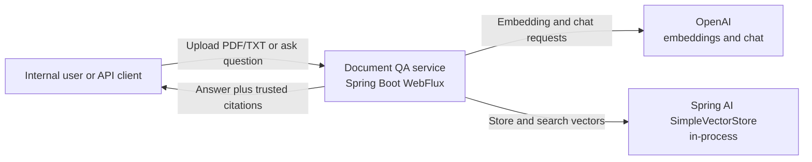
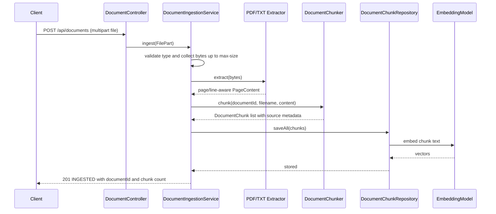
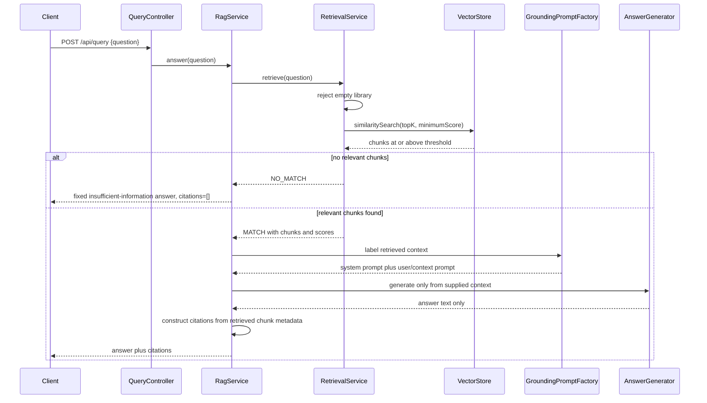

# UC1 Architecture and Engineering Decisions

## Purpose and scope

This service is the first working slice of an internal insurance-document question-answering system. It accepts PDF and TXT files, preserves source metadata, creates embeddings, retrieves semantically relevant chunks, generates an answer from retrieved context, and returns backend-owned citations.

The design is intentionally small enough for a three-day assessment and a 45-minute engineering discussion. It demonstrates the correctness boundaries that matter for RAG—retrieval quality, weak-match handling, grounding, and citation provenance—without adding unrelated production infrastructure.

## System context

`SimpleVectorStore` is an assignment choice, not the intended large-scale store. It removes Docker and database setup from the first runnable slice while preserving Spring AI's `VectorStore` boundary.

## Component responsibilities

| Component | Responsibility | Important boundary |
|---|---|---|
| `DocumentController` | Multipart upload API | HTTP concerns only |
| `DocumentIngestionService` | Size-bounded reading, extraction, chunking, storage | Moves blocking work to `boundedElastic` |
| `DocumentValidator` | Accept only compatible PDF/TXT filename and media-type combinations | Rejects unsupported input before extraction |
| `PdfDocumentExtractor` | Extract one page at a time with PDFBox | PDF page number is assigned by backend code |
| `TextDocumentExtractor` | Decode UTF-8 text and retain line metadata | TXT has line ranges instead of invented pages |
| `DocumentChunker` | Build configurable overlapping word windows | Copies source metadata into every chunk |
| `DocumentChunkRepository` | Store chunks and perform semantic search | Hides the vector-store implementation |
| `RetrievalService` | Empty-library check, top-K search, minimum-score gate | Weak retrieval stops before generation |
| `GroundingPromptFactory` | Label retrieved passages and construct the restricted prompt | Only retrieved text enters model context |
| `AnswerGenerator` | Replaceable chat-model boundary | Makes external generation mockable |
| `RagService` | Orchestrate retrieval, generation, and response assembly | Citations are created from retrieved chunks |
| `GlobalExceptionHandler` | Map failures to structured API errors | Consistent error codes and statuses |

## Upload sequence

The upload is read as a stream of WebFlux `DataBuffer` objects, but the accepted content is accumulated in memory because the configured maximum is 10 MB. The service checks the running byte count and fails immediately when it exceeds the limit. PDFBox and the synchronous embedding/vector APIs run on Reactor's bounded-elastic scheduler because they are blocking operations.

## Query and grounding sequence

## Citation trust model

Each `DocumentChunk` carries a generated `chunkId`, `documentId`, filename, chunk index, and either a PDF page number or TXT line range. The repository writes this metadata alongside the vector. Retrieval results are mapped back to the original backend-owned chunks.

The LLM sees source labels to understand context boundaries, but it is explicitly told not to generate citations. Its response is treated only as answer text. `RagService` constructs the response citations from the retrieved `DocumentChunk` objects, making an invented page number or document ID impossible through normal model output.

The current response cites every retrieved chunk supplied to the model. This is conservative and trustworthy but can over-cite. A later version could request structured claim-to-source identifiers, reject identifiers outside the retrieved set, and return only sources actually associated with answer claims.

## Relevance and weak-match decision

Vector search always has a nearest neighbor, even for unrelated questions. The service therefore does not equate “top result” with “relevant result.” It submits both configurable `top-k` and `minimum-score` values in Spring AI's `SearchRequest`. If the store returns no chunks at or above the threshold, `RetrievalService` returns `NO_MATCH`; `RagService` produces a fixed response and never calls the chat model.

The initial threshold of `0.70` is a starting point. Similarity scores depend on the embedding model, distance conversion, vector-store implementation, and document domain. The threshold must be calibrated with labeled relevant and irrelevant question-passage pairs before production use.

## Reactive and blocking boundaries

WebFlux provides nonblocking HTTP request handling, but the implementation does not claim PDFBox or the AI SDKs are nonblocking:

- File data arrives reactively and is released after copying.
- Extraction, embedding/storage, retrieval, and chat generation are synchronous operations.
- Those synchronous operations execute on `Schedulers.boundedElastic()`.
- The code avoids nested `block()` calls and exposes `Mono` from controllers through orchestration.

This is a pragmatic reactive design: event-loop threads remain protected without obscuring the actual behavior of third-party libraries.

## Key decisions and trade-offs

### In-memory vector store

- **Decision:** Use Spring AI `SimpleVectorStore` behind `DocumentChunkRepository`.
- **Why:** It produces a genuine embedding and similarity-search path with minimal reviewer setup.
- **Trade-off:** Vectors are lost on restart and searches scan memory linearly.
- **Production direction:** Use a persistent approximate-nearest-neighbor store such as Chroma or PostgreSQL with pgvector, while preserving the repository contract.

### Simple overlapping chunks

- **Decision:** Use configurable 600-word windows with 100-word overlap, independently within each PDF page/source block.
- **Why:** Medium chunks retain enough surrounding meaning, while overlap reduces information loss at boundaries.
- **Trade-off:** Word counts only approximate model tokens, and page-local chunking may produce small fragments near page breaks.
- **Production direction:** Use the embedding model's tokenizer, structure-aware boundaries, and evaluation-driven chunk parameters.

### Backend-owned citations

- **Decision:** Construct citations after generation from retrieved metadata.
- **Why:** Citation identity is deterministic and cannot be hallucinated by the LLM.
- **Trade-off:** Citing all supplied chunks may be broader than the exact evidence used in a sentence.
- **Production direction:** Add validated claim-to-source attribution without allowing arbitrary model-provided identifiers.

### HTTP 409 for an empty library

- **Decision:** Return `409 Conflict` with `EMPTY_DOCUMENT_LIBRARY`.
- **Why:** The query is structurally valid but conflicts with current server state; uploading a document makes the same operation valid.
- **Trade-off:** `422 Unprocessable Content` is also defensible.
- **Production direction:** Keep the status stable in a versioned API and document it for clients.

## Security and operational scope

The slice does not include authentication, authorization, tenant isolation, malware scanning, OCR, encryption policy, rate limiting, durable storage, or production telemetry. Those are important for an insurer, but including them here would dilute the requested assessment. Secrets are environment-provided and are not committed.

## Verification strategy

The tests cover unit boundaries and HTTP behavior without paid calls. A deterministic test embedding model drives the real `SimpleVectorStore`, and a recording answer generator replaces the external LLM. The end-to-end test uploads the sample policy, retrieves it semantically, verifies that its text reached the grounded prompt, and checks that the response contains the original source citation.
